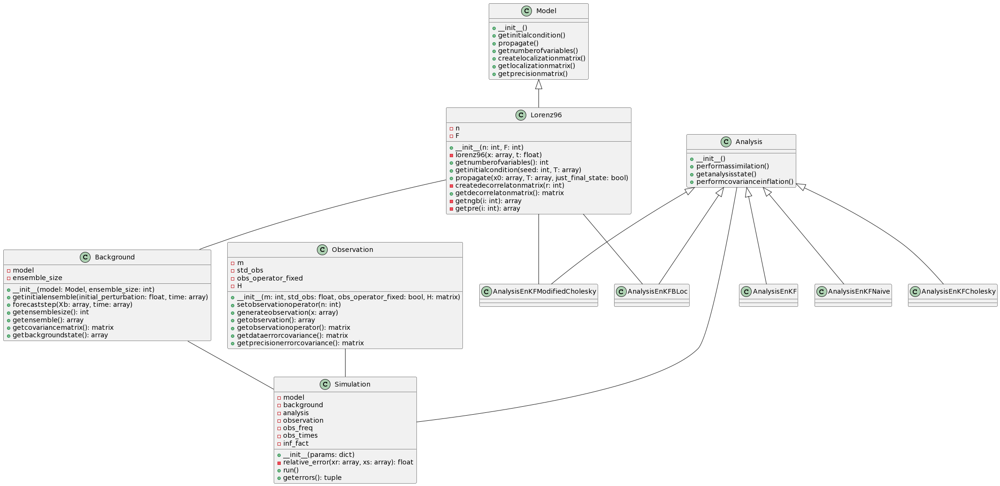

---
# Data Assimilation (Graduate Course)

**Elías D. Nino-Ruiz, Ph.D.**  
📧 - enino@uninorte.edu.co - elias.d.nino@gmail.com  
:computer: - https://enino84.github.io/ - https://aml-cs.github.io/

_This course belongs to the Ph.D. program in Systems Engineering at Universidad del Norte, Barranquilla, Colombia_


## 🚀 Welcome 

Welcome to this free graduate course on Data Assimilation! This course has been designed to provide you with a comprehensive overview of the fundamentals of Data Assimilation. When I started in this field, I remember how challenging it was to understand the various concepts and topics related to Computer Science, Meteorology, and Applied Mathematics, many of which I had never encountered before. I had previously worked on Combinatorial Optimization, and transitioning to the world of DA was not easy. However, as I progressed in my Ph.D., I found the field fascinating. The idea of forecasting based on fitting numerical models to observations or correcting model trajectory based on measurements caught my attention.

If you're feeling overwhelmed by the physics and math involved in DA, don't worry. This course is designed to make it easy for you to understand even the most complex concepts. I've used Python to demonstrate how simple it can be to implement DA methods. Additionally, I've provided a Python package that allows you to build your own DA methods easily within an academic context.

I hope you find this course enjoyable and informative. Please feel free to share it with anyone who may benefit from it.

## Overview 

This graduate course in Data Assimilation explores the process of adjusting imperfect numerical forecasts using real noisy observations. The course covers ensemble-based data assimilation, including conceptual, theoretical, and practical aspects. Students will use Python as the primary computational language to support their learning and discussions.

## Student Outcomes 

Upon completing this course, students will be able to:

1. Design data assimilation problems effectively.
2. Mitigate the impact of sampling errors in ensemble-based data assimilation.
3. Employ spatial error correlations to reduce uncertainty in numerical forecasts.
4. Quantify uncertainty in analysis solutions.

## Course Justification

Numerical models play a crucial role in various scientific contexts as they help encapsulate our knowledge of natural phenomena's physics and dynamics. These models typically involve Partial Differential Equations, which allow us to better understand how our world works. However, they only partially represent the real physics and dynamics of nonlinear phenomena, leading to limited validity in forecasts.

While observations can be used to build machine learning models and produce forecasts, they only temporarily capture the actual dynamics, and extrapolation assumptions are poorly maintained in practice. Moreover, measurements are only available in certain regions with sensors or satellite radiances.

Combining both sources of information—numerical forecasts and observations—leads to more accurate predictions and valid forecasts for more extended periods, even in areas where observations are unavailable. This course aims to provide students with the skills to effectively combine these sources and improve forecasts in various scientific contexts.

## Topics 

1. Background - Vectors, Matrices, and Operations
2. Numerical models
3. Sequential Data Assimilation
4. Ensemble-based Data Assimilation
5. Inflation and Localization Methods

# Materials 

### Background - Vectors, Matrices, and Operations

Understanding the concepts of vectors, matrices, and their operations is crucial in data assimilation because they form the foundation of mathematical models and computational techniques used in the field. The representation of vectors as column vectors, various vector and matrix operations, norms, and decompositions are all vital components in the process of combining numerical forecasts with real-world observations to improve predictions.

Vectors and their operations, such as inner and outer products, allow the manipulation and representation of data in multidimensional spaces. This is essential in data assimilation, as it often deals with large amounts of data from different sources, and these operations help combine, compare, and analyze the information.

Matrices play a significant role in data assimilation as they represent linear transformations, systems of equations, and relationships between variables. Understanding the properties of square matrices, such as positive definiteness, orthogonality, and triangular matrices, is necessary for analyzing and solving various problems in data assimilation.

Matrix norms and properties are essential in determining the quality and stability of numerical solutions. The condition number, for instance, helps assess the sensitivity of a problem to perturbations in the input data, which is crucial for understanding the reliability of the assimilation results.

Decompositions, such as Singular Value Decomposition (SVD) and spectral decomposition, provide valuable insights into the structure of matrices and facilitate solving complex problems more efficiently. These techniques are used in data assimilation to analyze and process large datasets, reduce dimensions, and improve computational efficiency.

A thorough understanding of vectors, matrices, and their associated concepts is critical for students studying data assimilation. These foundational concepts enable them to develop and apply advanced techniques in data assimilation to improve numerical forecasts and reduce uncertainties in various scientific contexts.

- Vectors, Matrices, and Operations - [Slides](DA_Background_01022022.pdf) - [Jupyter Notebook](https://colab.research.google.com/drive/1d_X8iP08tZqXTpJq-cuneaeCGXr2dw7t?usp=sharing)
- Numerical Integration `scipy.integrate.solve_ivp` - [Jupyter Notebook](https://colab.research.google.com/drive/1kkhc9SnjT_igN7irWEh9t2BSy8RsB92H?usp=sharing)

### Numerical models

Numerical models play a critical role in data assimilation. They are used to simulate the physical processes that govern the behavior of the atmosphere, ocean, or other systems of interest. These models are designed to solve the equations that describe these processes using numerical methods.

In data assimilation, numerical models are used to generate forecasts of the system state. These forecasts are then compared to observations, and the resulting differences are used to update the model state through the assimilation process. The accuracy of the forecasts depends on the accuracy of the numerical models used to generate them.

The use of numerical models in data assimilation presents several challenges. First, numerical models are often computationally expensive, which limits their practical use in real-time applications. Second, numerical models are subject to errors and biases, which can affect the accuracy of the forecasts and the quality of the assimilation results. To address these challenges, researchers have developed a variety of techniques to improve the accuracy and efficiency of numerical models, such as model error correction, adaptive model refinement, and stochastic parameterization.

- Numerical models, forecasts, and background error propagation - Duffing Equation - [Jupyter Notebook](https://colab.research.google.com/drive/1dplVJoM--eDRknG9wRpEk4ibTINU2yWV?usp=sharing)
- Numerical models, forecasts, and background error propagation - The Lorenz 96 model - [Jupyter Notebook](https://colab.research.google.com/drive/1ozWQsgDyozu2K6ehH8OVy1e81Td1UDlc?usp=sharing)
- Numerical models, forecasts, and background error propagation - The Lorenz 63 model - [Jupyter Notebook](https://colab.research.google.com/drive/14CWIO_pWj_TObq2laLK68QcSFRtu9ikX?usp=sharing)

### Sequential Data Assimilation

Sequential data assimilation is a technique used to assimilate new observations into a dynamical system over time. In this approach, observations are assimilated sequentially, one at a time, as they become available. The goal of sequential data assimilation is to estimate the state of the system at each time step, given the available observations up to that point in time.

One common approach to sequential data assimilation is the Kalman filter, which is a linear data assimilation method that was originally developed for tracking the position and velocity of objects in space. The Kalman filter provides an estimate of the state of the system at each time step, along with an estimate of the uncertainty associated with that estimate.

More generally, sequential data assimilation can be carried out using a variety of algorithms, including ensemble-based methods such as the Ensemble Kalman Filter (EnKF) and Particle Filters. These methods are well-suited to handling non-linear and non-Gaussian systems, and are widely used in the atmospheric and oceanic sciences for weather forecasting and climate modeling.

Sequential data assimilation is a powerful technique for integrating observations into dynamical models over time, and has important applications in a wide range of fields, including weather forecasting, climate modeling, and control systems engineering.

- Introduction to Data Assimilation - [Slides](<Introduction to Data Assimilation.pdf>) 
- Bayes' Theorem and one dimensional data assimilation - [Slides](DA_Bayes_Theorem.pdf), [Class Notes](<DA_12082020 - Bayes' Theorem - Simple Least Squares Explanation.pdf>)
- One dimensional case Bayes' Theorem prior distribution 3D-Var - [Jupyter Notebook](https://colab.research.google.com/drive/1QTy5EOmN2A0BBCTv7at-QWOXcD7vkd6K?usp=sharing)
- One dimensional case Bayes' Theorem prior and posterior distributions 3D-Var - [Jupyter Notebook](https://colab.research.google.com/drive/1adwPh5hpAXOAb-qWnnD9UbekXYUqlL28?usp=sharing)

### Ensemble-based Data Assimilation

Ensemble-based data assimilation is a technique used to estimate the state of a dynamical system by combining observations with a set of model simulations, or "ensemble members". The idea behind this approach is to use the ensemble members to represent the range of possible states of the system, and to use the observations to constrain this range and obtain a more accurate estimate of the true state.

One common ensemble-based data assimilation method is the Ensemble Kalman Filter (EnKF), which is a non-parametric filter that uses an ensemble of model simulations to estimate the state of the system. In the EnKF, the ensemble members are perturbed from the mean state, and the perturbations are used to estimate the covariance of the system. This covariance matrix is then used to update the state estimate at each assimilation step.

Another popular ensemble-based method is the Particle Filter, which is a sequential Monte Carlo method that uses a set of particles to represent the state of the system. The particles are updated sequentially based on the observations, and are resampled at each time step to ensure that they accurately represent the distribution of possible states.

Ensemble-based data assimilation has become increasingly popular in recent years, particularly in the atmospheric and oceanic sciences, due to its ability to handle non-linear and non-Gaussian systems, and its flexibility in handling different types of observations and model configurations. However, ensemble-based methods can be computationally intensive, and require careful tuning and calibration to achieve optimal performance.

- Deriving the ensemble Kalman filter formula - primal and dual implementations - Woodbury matrix identity - [Class Notes](<26-08-2020 - The Ensemble Kalman Filter - Filter Formulations - Geir EvensenDA_26082020.pdf>)
- How to build an initial ensemble for the Lorenz 63 model + creating a benchmark to test ensemble based methods - [Jupyter Notebook](https://colab.research.google.com/drive/16zT0-bVkyv4THSMlB4WjjM_aRcGDi4cY?usp=sharing)
- The ensemble Kalman filter - Duffing equation - [Class Notes](DA_ENDJ_Efficient.pdf) - [Jupyter Notebook](https://colab.research.google.com/drive/1hJzft1NoYESWmgQINCQk2IwHIgdpg9ba?usp=sharing)
- The ensemble Kalman filter - Naive - Lorenz96 - [Jupyter Notebook](https://colab.research.google.com/drive/1Lu_mWAg5thJEpmFPbgfQ8byidXw5nwS6?usp=sharing)
- Ensemble square root filters - [Jupyter Notebook](https://colab.research.google.com/drive/1Bg5uETre82EQwMJTwCR4myL4QEfa9wKL?usp=sharing)
- Ensemble transform Kalman filter - [Jupyter Notebook](https://colab.research.google.com/drive/1tId5_9LHhy7Kw9t_ePHcBggTKhX_aXrm?usp=sharing)

### Inflation and Localization Methods 

Inflation and localization are two important techniques used in data assimilation to help improve the accuracy and efficiency of the assimilation process.

Inflation is a technique used to adjust the error covariance matrix of the ensemble members in ensemble-based methods such as the Ensemble Kalman Filter (EnKF). The purpose of inflation is to ensure that the ensemble members represent the correct distribution of possible states, by increasing or decreasing the spread of the ensemble as needed. This can help to prevent filter divergence and ensure that the filter remains stable over time.

Localization is a technique used to limit the influence of observations on the state estimates in areas where the observations are not expected to be accurate or informative. This can help to prevent "overfitting" of the observations and ensure that the state estimates are more robust and accurate. Localization is typically implemented by weighting the observations based on their spatial and temporal proximity to the state estimate, and by applying a localization function that reduces the influence of observations that are too far away.

Both inflation and localization are important techniques in data assimilation, as they help to ensure that the assimilation process is accurate, efficient, and robust to errors and uncertainties in the observations and the model. These techniques are widely used in atmospheric and oceanic sciences, as well as in other fields such as geophysics, finance, and engineering.

- Inflation and localization - [Class Notes](DA_ENDJ_Localization_Inflation.pdf)
- Precision matrix localization - the ensemble Kalman filter based on a modified Cholesky decomposition - [Class Notes](DA_23092020.pdf)
  - `Nino-Ruiz, Elias D.`, Adrian Sandu, and Xinwei Deng. _An ensemble Kalman filter implementation based on modified Cholesky decomposition for inverse covariance matrix estimation._ **SIAM Journal on Scientific Computing** 40.2 (2018): A867-A886.  
- Efficient implementations of EnKF - accounting for inflation and localization - [Jupyter Notebook](https://colab.research.google.com/drive/11lo2bXULokQaEg34IWgmss2BqXa1xmVg?usp=sharing) 
- Local ensemble Kalman filter (LEnKF) - [Jupyter Notebook](https://colab.research.google.com/drive/1QJHAEW6uo4Y_Dt1_T3UHgf2fASsSCyCM?usp=sharing)
- Now, you are prepared to delve deeper and utilize our DA package for teaching or learning Data Assimilation:
  - `Nino-Ruiz, Elias D.`, and Sebastian Racedo Valbuena. _TEDA: A Computational Toolbox for Teaching Ensemble Based Data Assimilation_. In: Computational Science – ICCS 2022: 22nd International Conference, London, UK, June 21-23, 2022, Proceedings, Part IV. Cham: Springer International Publishing, 2022.
  - The UML class diagram for our toolbox can be viewed below. You can find an example of how to use it in this [Jupyter Notebook](https://colab.research.google.com/drive/1P3evF_e1wS_pzm5PGtCm88N7nqO73tN-?usp=sharing), and access the complete GitHub code [here](https://github.com/enino84/TEDA).
  - To run TEDA, it's as simple as:
 
```python
model = Lorenz96();
background = Background(model,ensemble_size=60);
analysis = AnalysisEnKF();
observation = Observation(m=32,std_obs=0.01);

simulation = Simulation(model,background,analysis,observation);
simulation.run();
error_b, error_a = simulation.geterrors();
```



## Are you ready for a more realistic scenario?

We invite you to try out our AMLCS-DA package, a powerful data assimilation tool that is designed to work with the Atmospheric General Circulation Model, SPEEDY.

The AMLCS-DA package is available on GitHub at [https://github.com/enino84/AMLCS](https://github.com/enino84/AMLCS). It is an open-source package written in Python and designed to be user-friendly, allowing for easy implementation of data assimilation methods in atmospheric sciences.

Our package has been extensively tested and has been published in a peer-reviewed journal. The paper, titled "AMLCS-DA: A data assimilation package in Python for Atmospheric General Circulation Models," is available at the following link: [https://doi.org/10.1016/j.softx.2023.101374](https://doi.org/10.1016/j.softx.2023.101374).

We encourage you to explore our AMLCS-DA package and discover the benefits of using it for your data assimilation needs. Thank you for considering our tool, and we look forward to hearing your feedback!


---

```Numbers 6:24-26``` - The Lord bless you and keep you; the Lord make his face shine on you and be gracious to you; the Lord turn his face toward you and give you peace.

---

