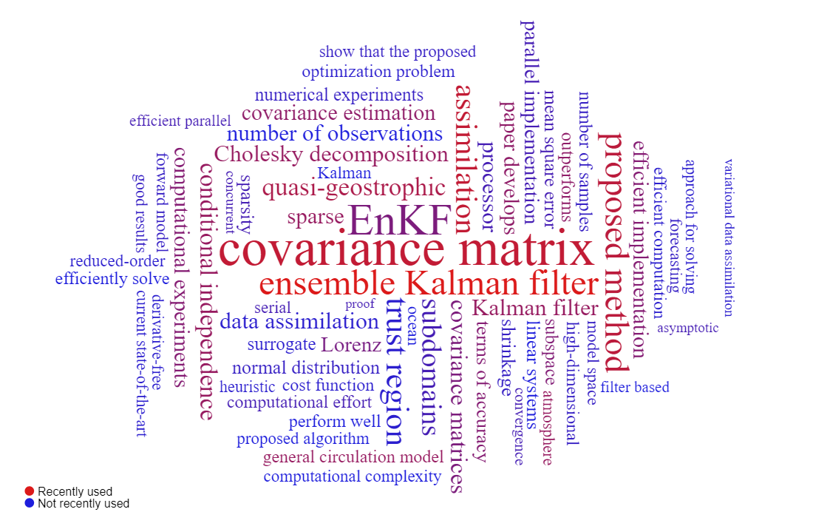
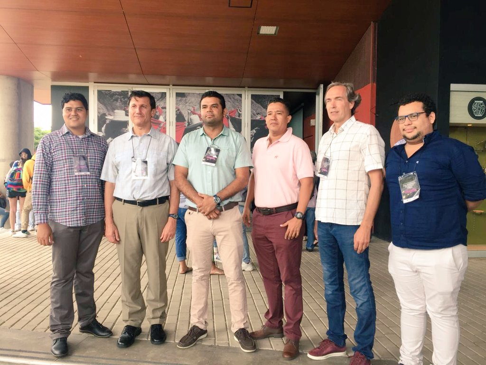
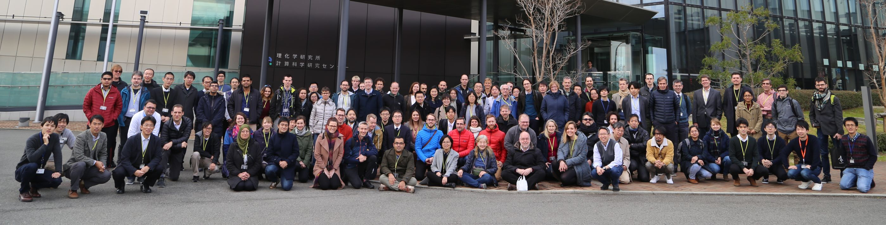
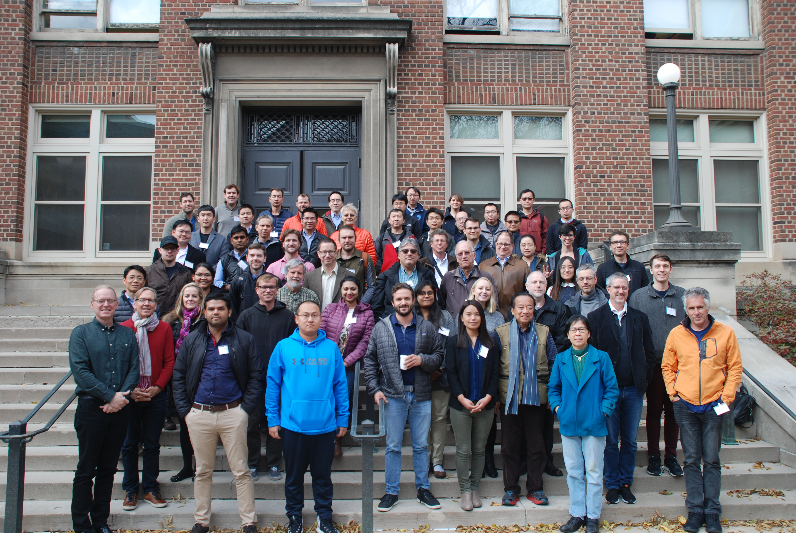
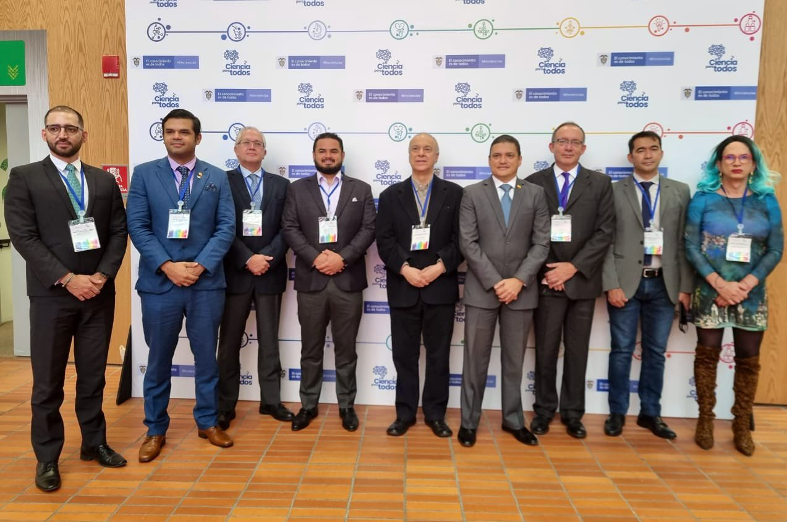

# Elías D. Niño-Ruiz, Ph.D.

# Short Bio

Elias D. Nino-Ruiz obtained the Diploma in System Engineering (2007) from the Universidad del Norte (UniNorte) Barranquilla, Colombia, M.Sc. in System Engineering (2009) and M.Sc. in Industrial Engineering (2010) from UniNorte, and Ph.D. in Computer Science and Applications (2015) from the Virginia Polytechnic Institute and State University (Virginia Tech) Blacksburg, USA. He worked as an intern at Argonne National Laboratory, USA (2013) and Lawrence Livermore National Laboratory, USA (2014). He served as a research assistant (2011-2015) in the <a href="https://csl.cs.vt.edu/" target="_blank">Computational Science Laboratory</a> and as an instructor of Numerical Methods (2015) at Virginia Tech. In 2016, he joined <a href="https://www.uninorte.edu.co/web/departamento-de-ingenieria-de-sistemas-y-computacion/docentesdpto" target="_blank">UniNorte's Department of Systems Engineering</a>; he works as an Associate Professor and the Director of the <a href="https://aml-cs.github.io/" target="_blank">Director of the Applied Math and Computer Science Laboratory</a>. In 2022, he joined the Early Career Advisory Board of the Control Engineering Practice Journal, Elsevier. Nino's research interests are in the area of Computational Science, Applied Mathematics, and Applied Statistics.

 
<a href="https://twitter.com/elias_david_84?ref_src=twsrc%5Etfw" class="twitter-follow-button" data-show-count="false" target="_blank">Follow @elias_david_84</a>

 
**My favorite quote:** Isaiah 40:31. But they who wait for the ``LORD`` shall renew their strength; they shall mount up with wings like eagles; they shall run and not be weary; they shall walk and not faint.

# Posts - News - Last update May 09, 2023

🚀 I am excited to announce the launch of my new online course on Data Assimilation, which is completely free! This course is designed to help you understand all the essential concepts and methods of Data Assimilation through comprehensive notes and practical Python programs. Whether you're new to the field or seeking to expand your knowledge, this course provides you with a solid foundation in Data Assimilation. Plus, with the Python programs provided, you can gain practical experience and see how Data Assimilation methods are implemented in real-world scenarios. You can access the course through the following link: [Data Assimilation](https://enino84.github.io/courses/intro_data_assimilation/). And, please feel free to share the course with anyone who may benefit from it. Thank you for considering this course, and I hope it helps you in your journey to become a proficient Data Assimilation practitioner! (Updated May 09, 2023)

✔️ Save the date! On April 28th, 2023, the Universidad del Norte is hosting the Systems Engineering Day 202310. Join us at the Auditorio Marvel Moreno at 8:20 a.m. for a day full of insightful talks and exciting discussions. <a href="https://enino84.github.io/UN_DIS_202310">Click here</a> to find out more details about the event, including the schedule and the speakers. We can't wait to see you there!. 

✔️ I'm happy to share with you my most recent publication in Tellus A: Dynamic Meteorology and Oceanography:

⌨️ Popov, AA, Sandu, A, `Nino Ruiz, ED` and Evensen, G. 2023. _A Stochastic Covariance Shrinkage Approach in Ensemble Transform Kalman Filtering_. **Tellus A: Dynamic Meteorology and Oceanography**, 75(1): 159–171. DOI: <a href="https://doi.org/10.16993/tellusa.214" target="_blank">https://doi.org/10.16993/tellusa.214</a>  (Updated on April 11, 2023).

✔️ I'm happy to share with you my most recent publication in SoftwareX, Elsevier:

⌨️ `Nino-Ruiz, E.D.`, & Consuegra Ortega (2023) _AMLCS-DA: A data assimilation package in Python for Atmospheric General Circulation Models_. **SoftwareX**, Elsevier, 1– 10. Available from: <a href="https://doi.org/10.1016/j.softx.2023.101374" target="_blank">https://doi.org/10.1016/j.softx.2023.101374</a>  (Updated on March 31, 2023).

✔️ I'm happy to share with you my most recent publication in Quarterly Journal of the Royal Meteorological Society:

⌨️ `Nino-Ruiz, E.D.`, Consuegra Ortega, R.S. & Lucini, M.(2023) _Ensemble based methods for leapfrog integration in the simplified parameterizations, primitive-equation dynamics model_. **Quarterly Journal of the Royal Meteorological Society**, RMetS, 1– 15. Available from: <a href="https://doi.org/10.1002/qj.4424" target="_blank">https://doi.org/10.1002/qj.4424</a>  (Updated on February 08, 2023).

✔️ I'm officially part of the Early Career Advisory Board for the <a href="https://www.sciencedirect.com/journal/control-engineering-practice" target="_blank">Control Engineering Practice Journal</a>, thanks to Elsevier for this opportunity! (Updated on April 20, 2022)

✔️ <a href="ENDJ - CV - ElíasN - Academic.pdf" target="_blank">CV Elías D. Nino-Ruiz</a> (Updated on February 08, 2023).

# 📒 Free online courses and educational content

📔 `Data Assimilation (Graduate Course)` - This online course on Data Assimilation has been designed to provide a comprehensive understanding of essential concepts and methods. The course is free and includes detailed notes and practical Python programs to help learners gain practical experience in implementing Data Assimilation methods in real-world scenarios. It is suitable for both beginners and those seeking to expand their knowledge in the field. [Click here to go to this resource.](https://enino84.github.io/courses/intro_data_assimilation/)

# Professional Networks

<a href="https://orcid.org/0000-0001-7784-8163" target="_blank">
ORCID
</a>, <a href="https://scholar.google.com/citations?user=IE8dAAgAAAAJ&hl=en" target="_blank">Google Scholar</a>, <a href="https://www.scopus.com/authid/detail.uri?authorId=36603283600" target="_blank">SCOPUS Author Profile</a>, <a href="https://aml-cs.github.io/" target="_blank">Applied Math and Computer Science Lab</a>

# Education

1. Ph.D. in Computer Science and Applications, ``Virginia Polytechnic Institute and State University``, USA. Thesis: <a href="https://vtechworks.lib.vt.edu/handle/10919/64438" target="_blank">Efficient Formulation and Implementation of Ensemble based Methods in Data Assimilation</a>. GPA: 3.63 out of 4.0., Advisor: <a href="http://people.cs.vt.edu/~asandu/" target="_blank">Prof. Adrian Sandu</a>.
2. M.Sc. in Systems Engineering, ``Universidad del Norte``, Colombia. Thesis: MODS: A Novel Metaheuristic of Deterministic Swapping for the Multi-Objective Optimization of Combinatorial Problems. GPA 4.28 out of 5.0., Advisor: Carlos Ardila, M.Sc.
3. M.Sc. in Industrial Engineering, ``Universidad del Norte``, Colombia. Thesis: A Novel Algorithm Based on Deterministic Finite Automaton for Solving the Mono-objective Symmetric Traveling Salesman Problem, GPA 4.45 out of 5.0., Advisor: Carlos Ardila, M.Sc.
4. B.Sc. in Systems Engineering,  ``Universidad del Norte``, Colombia. Thesis: Numerical Methods for Multivariate Optimization, GPA 4.02 out of 5.0., Advisor: Carlos Ardila, M.Sc.

# Certifications

# Experience
---
## Research Experience

### Director of the Applied Math and Computer Science Lab. 

- Spring 2017 to Current. 
- Department of Computer Science, ``Universidad del Norte``, BAQ 080001, Colombia. 
- Description: Scientific Computing methods for the solution of real-life problems. 

### Research Assistant

- June 2014 to July 2014.
- Mathematics and Computer Science Division, ``Lawrence Livermore National Laboratory``, CA 94550, USA.
- Supervisor: Greg Bronevetsky, Ph.D.
- Description: Analysis of sequential data assimilation methods using the SIGHT toolbox. 

### Givens Associate

- June 2013 to August 2013
- Mathematics and Computer Science Division, ``Argonne National Laboratory``, IL 60439, USA.
- Supervisor: Cosmin Petra, Ph.D. 
- Description: Working on time-dependent, background-error covariance matrix estimation.

### Research Assistant

- August 2011 to December 2015
- Computational Science Laboratory, Computer Science Department, ``Virginia Polytechnic Institute and State University``, VA 24060, USA.
- Supervisor: Adrian Sandu, Ph.D.
- Description: Working on sequential and variational data assimilation for the weather forecast. 

---
## Work Experience

### Associate Professor

- Spring 2023 - Current.
- Department of Systems Engineering, ``Universidad del Norte``, BAQ 080001, Colombia

### Associate Professor & Department Head

- Spring 2018 - Spring 2023.
- Department of Systems Engineering, ``Universidad del Norte``, BAQ 080001, Colombia

### Instructor of Data Assimilation

- Fall 2020, Fall 2021.
- Ph.D. Program in Mathematical Engineering, ``Universidad EAFIT``, MDE 050001, Colombia.

### Teaching Assistant of Data Science for All
 
- Fall 2020 - Current
- Program of Data Science for All - Colombia, ``Correlation-One (DS4A - Colombia)``, USA

### Assistant Professor 

- Spring 2016 - Fall 2017.
- Department of Systems Engineering, ``Universidad del Norte``, BAQ 080001, Colombia.

### Instructor of Numerical Methods

- Fall 2015.
- Department of Computer Science, ``Virginia Polytechnic Institute and State University``, VA 24060, USA.

---
# Keynote Talks

- 09/06/2021 - <a href="http://www.youtube.com/watch?v=7_laGIOn__I&t=238m39s" target="_blank">Ensemble based Data Assimilation via a Modified Cholesky Decomposition</a>, <a href="https://enkf.norceprosjekt.no/previous-workshops/enkf-workshop-2021-free-online-event-" target="_blank" style="text-decoration: none">``EnKF Workshop 2021``</a>, NORCE Norwegian Research Centre AS, 2021. - **English**
- 22/01/2019 - <a href="https://www.youtube.com/watch?v=1eqTuMCGnKY" target="_blank">Ensemble Kalman Filter Based On A Modified Cholseky Decomposition</a>, <a href="http://www.data-assimilation.riken.jp/isda2019/" target="_blank" style="text-decoration: none">``ISDA 2019 - 7th International Symposium on Data Assimilation``</a>, RIKEN R-CCS, Kobe, Japan, 2019. - **English**

# Invited Talks

- 24/06/2021 - <a href="https://www.youtube.com/watch?v=F-fp1Ze5a7g" target="_blank">Implementaciones Eficientes de Métodos de Asimilación de Datos Secuenciales para el Pronóstico Meteorológico</a>. ``Asociación de Universidades Grupo Montevideo (AUGM)``. Webinar. **Spanish**
- 27/05/2020 - <a href="https://www.youtube.com/watch?v=COo-wWCS46o" target="_blank">Uso de la Analítica de Datos para Enfrentar los Nuevos y Rápidos Retos que Enfrenta Nuestra Sociedad</a>. ``Webinar - Universidad del Norte``. **Spanish**
- 15/05/2020 - <a href="https://www.youtube.com/watch?v=mW3P-UxZDZA" target="_blank">Métodos de Machine Learning e Inteligencia Artificial: Oportunidades Para Estimar el Impacto del SAR-COV-2 en Colombia</a>. ``Webinar - Universidad del Norte``. **Spanish**
- 19/09/2019 - <a href="https://youtu.be/cf80zobQzGM" target="_blank">Efficient Implementation of Ensemble Based Methods</a>, ``First International Workshop on Data Assimilation for Decision Making``, Universidad del Norte, Barranquilla, Colombia. **English**
- 27/11/2018 - <a href="https://youtu.be/LELXfvfQTXE" target="_blank">Covariance Matrix Estimation</a>, ``Seminar of the Ph.D. in Mathematical Engineering``, Universidad EAFIT, Colombia. **English**

# Awards

1. <a href="https://www.iccs-meeting.org/iccs2017/awards/index.html" target="_blank">Best Workshop Paper Award</a>. A Surrogate Model Based On Mixtures Of Taylor Expansions For Trust Region Based Methods. ``ICCS - International Conference on Computational Science 2017``, Zurich, Zwitserland, June 2017.

# Peer reviews

- [List of some peer reviews](peer_reviews.md).

# Editorial boards

- [List of editorial services](editorial_services.md).

# Teaching

- [List of undergrad courses](undergrad_courses.md)
- [List of grad courses](grad_courses.md)

# My Word Cloud

Here is a word cloud of some of my research documents.

# Social Media

<a class="twitter-timeline" data-width="400" data-height="400" data-theme="dark" href="https://twitter.com/elias_david_84?ref_src=twsrc%5Etfw">Tweets by elias_david_84</a> 
 

 
# Some Good Memories
 
<meta name="viewport" content="width=device-width, initial-scale=1">

  
1 / 4

  
  
September 18-20, 2019. First International Workshop on Data Assimilation for Decision Making, Barranquilla, Colombia.

  
2 / 4

  
  
January 21-24, 2018. The 7th International Symposium on Data Assimilation (ISDA2019) at the RIKEN Center, Japan

  
3 / 4

  
  
October 22-26, 2018. IMA program on Recent Advances in Machine Learning and Computational Methods for Geoscience, USA

  
4 / 4

  
  
March 22, 2022. Supporting National Government in Misión de Sabios

<a class="prev" onclick="plusSlides(-1)">&#10094;</a>
<a class="next" onclick="plusSlides(1)">&#10095;</a>

 

   
   
   
   

<link rel="stylesheet" href="carousel.css">
